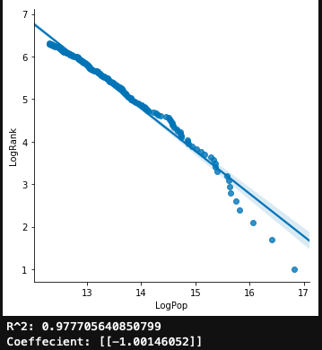

# Zipf's Law and US Metro Population Growth

This is a demonstration of the Zipfs Law (i.e. the Rank-Size Rule) using the 2017 Population Estimates supplied from the U.S. Census Bureau. 

## Project Overview:

I test the Zipf Law assertion that U.S. Metro Areas when plotted and regressed, exhibit a -1.0 regression coeffiecent. I use the 2017 U.S Metro Area Population Esitmates from the U.S Census Bureau and do end up confirming the initial assertion using this data. 

## Project Packages:

`pandas`
`matplotlib.pyplot`
`numpy`
`seaborn`
`sklearn.linear_model import LinearRegression`

